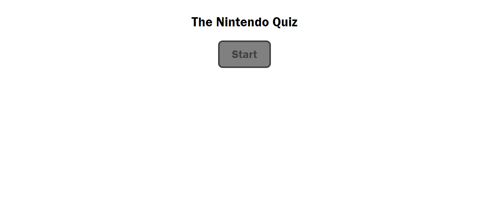

# nintendo-quiz

## Description

This quiz was created with HTML, CSS and JavaScript.

## Usage

Users can start the quiz by clicking on the start button, then they will answer 5 Nintendo related questions. When an incorrect answer is selected, time will be deducted from the clock. When all questions have been answered or time has run out, users will input their initials and log their score on the score board.

Here is the live website. [Try it out!](https://shanna-not-shawna.github.io/nintendo-quiz/)

## Credits

Dominique Meeks Gombe provided tutoring and guidance on this project.

## How to Contribute

If you would like to contribute to this project, please reach out to the author.